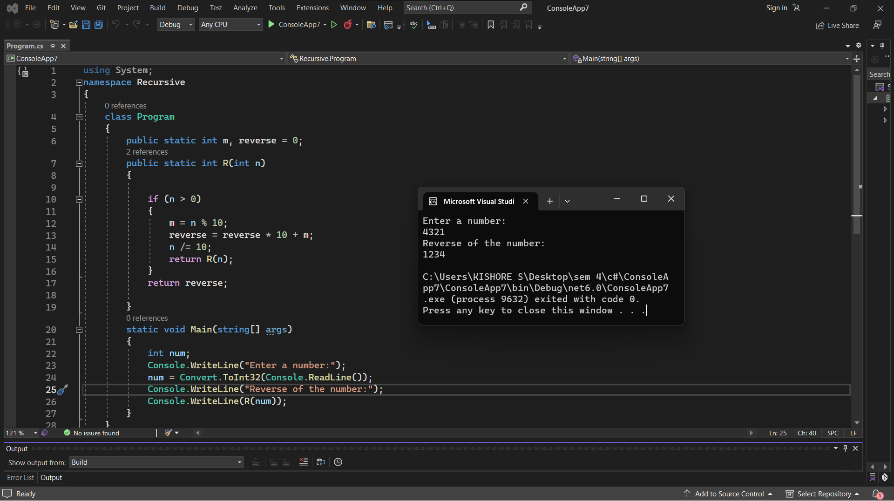

# Recursive-function

## Aim: 
To write a C# program to reverse a number using recursive function.

## Algorithm:
### Step 1:
Create a function for reversing.

### Step 2:
Get the input from the user.

### Step 3:
In the function find reminder of the number and multiply it by 10 and add the reverse number.

### Step 4:
Recrseively calling the function to get the reversed number.

### Step 5:
print the reversed number

## Program:
Dveloped by : kishore kumar s

reg no : 212221240023
```
using System;
namespace Recursive
{
    class Program
    {
        public static int m, reverse = 0;
        public static int R(int n)
        {

            if (n > 0)
            {
                m = n % 10;
                reverse = reverse * 10 + m;
                n /= 10;
                return R(n);
            }
            return reverse;

        }
        static void Main(string[] args)
        {
            int num;
            Console.WriteLine("Enter a number:");
            num = Convert.ToInt32(Console.ReadLine());
            Console.WriteLine("Reverse of the number:");
            Console.WriteLine(R(num));
        }
    }
}
```
## Output:

## Result:
C# program to reverse a number using recursive function is executed successfully.